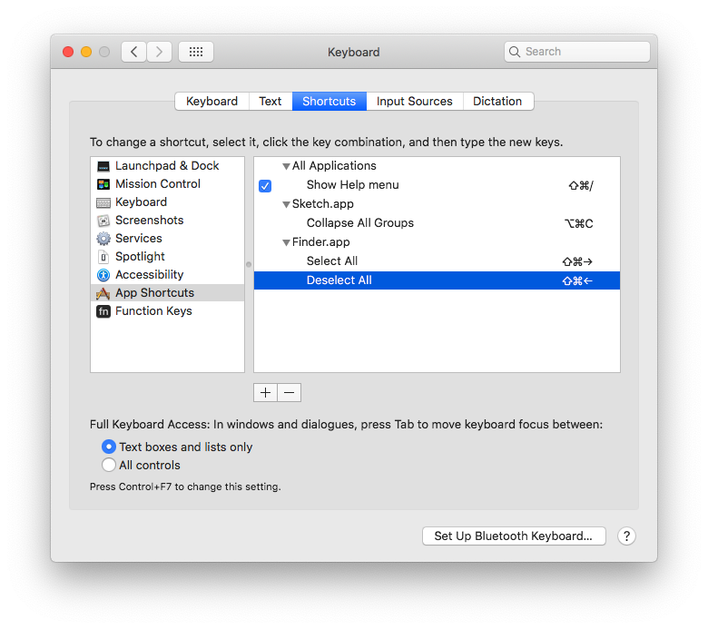

# Mac

## Screenshot just one window

```text
Command + Shift + 4
Spacebar
```

## Paste without formatting

```text
Command + Shift + V
```

## Reveal desktop

```text
Cmd + F3
```

## Switch between two windows of the same app

```text
Command + `
```

## Show/hide hidden folders

```text
Command + Shift + .
```

## Change default column width

```text
Alt (aka Option, ⌥) + Drag Width
```

## Change default app

[RCDefault](http://www.rubicode.com/Software/RCDefaultApp/) lets you change the default application by e.g. file extension. When you install, it gets added to your system preferences panel

## Add custom app shortcuts


